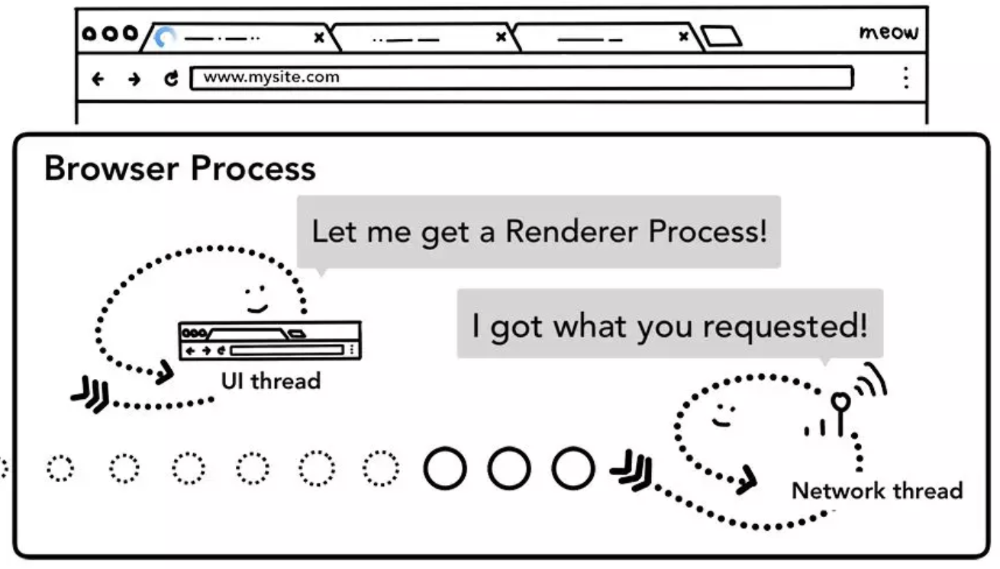

##

> - 进程和线程在浏览器内的分布
> - 进程和线程怎样配合展现页面
> - renderer进程内部实现
> - 处理用户交互

## 1. 进程和线程在浏览器内的分布

## 应用启动后发生了什么？

##

## 

## 浏览器架构 

## 

##

## chrome
- browser进程
    - 负责地址栏，书签栏，前进后退按钮等
    - 负责处理浏览器的一些不可见的底层操作，如网络请求和文件访问
- Renderer进程
    - 负责一个 tab 内关于网页呈现的所有事情
- Plugin进程
    - 负责控制一个网页用到的所有插件，如 flash
- GPU进程
    - 负责处理 GPU 相关的任务

## 

    - 不同进程负责的浏览器区域示意图

## 

## chrome 多进程优缺点
- 优点：安全
- 缺点：内存不共享

- 限制最多进程数，由设备内存和CPU能力决定。达到限制时与前一个共用一个渲染进程。 不同性能的硬件 进程划分不同。

##

##

## iframe渲染
- [Meltdown and Spectre](https://meltdownattack.com/): 读取本进程甚至其他进程内存空间(依赖高精度 timing)
- site Isolation 机制允许在同一个 Tab 下的跨站 iframe 使用单独的进程来渲染，这样会更为安全。chrome67开始默认使用。

##

## 
- Tab外的工作主要由browser进程掌控，browser对工作进行划分使用不同线程处理：

    - UI thread ： 控制浏览器上的按钮及输入框；
    - network thread: 处理网络请求，从网上获取数据；
    - storage thread: 控制文件等的访问；

## 2. 进程和线程怎样配合展现页面

浏览器进程对不同线程做分配

## How page shows?
在浏览器地址栏中输入 url 到页面展现的短短时间内浏览器究竟做了什么?

##

## 

UI thread 通知 Network thread 加载相关信息

##

判断响应内容的格式

##

##

收到 Network thread 返回的数据后，UI thread 查找相关的渲染进程

##

Browser Process 和 Renderer Process 通过 IPC 通信，请求 Renderer Process 渲染页面

##

Renderer Process 发送 IPC 消息通知 browser process 页面已经加载完成

##

浏览器进程发送 IPC 消息给渲染进程，通知要离开当前网站了

##

浏览器进程发送 IPC 消息到新的渲染进程通知渲染新的页面，同时通知旧的渲染进程卸载

##

Service Worker 依据具体情形做处理

## 3. renderer进程
- 主线程 Main thread
- worker线程 Worker thread
- 合成线程 Compositor thread
- 光栅线程 Raster thread

##

渲染进程包含的线程

## 渲染流程
> - 构建 DOM (DOM树)
> - 加载次级的资源
> - JS 的下载与执行(`async` ,`defer`)
> - 样式计算
> - 获取布局
> - 绘制各元素
> - 合成帧

##

主线程解析html文件，创建dom树

##

渲染进程主线程计算每一个元素节点的最终样式值

##

主线程遍历 DOM 及 对应元素的样式，构建出布局树

##

主线程依据布局树构建绘制记录

## 更新渲染管道是昂贵的

##

##

DOM+Style, Layout, and Paint trees in order it is generated

##

Animation frames on a timeline

##

Animation frames on a timeline, but one frame is blocked by JavaScript

##

Smaller chunks of JavaScript running on a timeline with animation frame

##

主线程遍历布局树生成层树

##

栅格线程会栅格化每一个磁贴并存储在 GPU 显存中

##

合成器线程会发送合成帧给 GPU 渲染

## 4.浏览器对事件的处理
- 在浏览器的看来，用户的所有手势都是输入，鼠标滚动，悬置，点击等等都是
- browser进程获取事件及位置，通知renderer进程
- renderer进程找到事件对象并执行绑定的相关处理

##

事件从浏览器进程传送给渲染进程

##

涉及 non-fast scrollable region 的事件，合成器线程会通知主线程进行相关处理

##

由于事件绑定在最顶部，整个页面都成为了 non-fast scrollable region
处理： `passive: true`

##

主线程依据绘制记录查找事件相关元素

## 事件的优化

##

Chrome 会合并连续事件到下一帧触发
    - getCoalescedEvents API 来获取组合的事件

##

## 更多了解

- [小米内核白皮书](http://doc.t.pt.miui.com/miwebview/whitepaper/)
- [内核之前的分享](https://wiki.n.miui.com/pages/viewpage.action?pageId=135290668)
- [Sandbox Renderer 的多进程模式](https://wiki.n.miui.com/pages/viewpage.action?pageId=134826566)
- [谷歌开发者文档](https://developers.google.com/web/updates/2018/09/inside-browser-part1)
- [像素渲染分享](http://ppt.t.pt.miui.com/lihuichao/ppt/pixel/)

## Q&A
